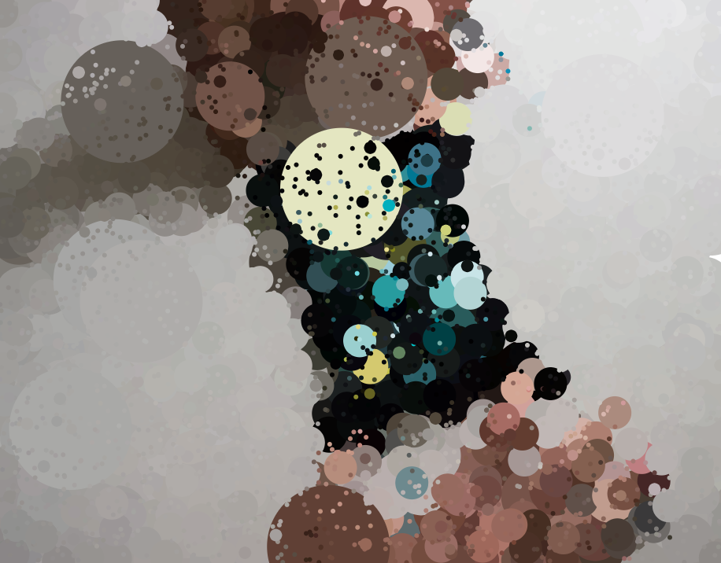
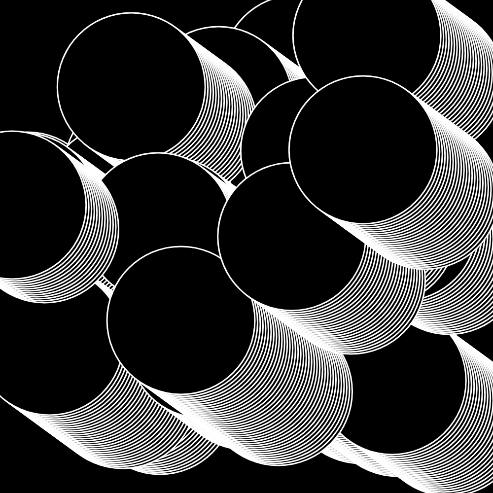
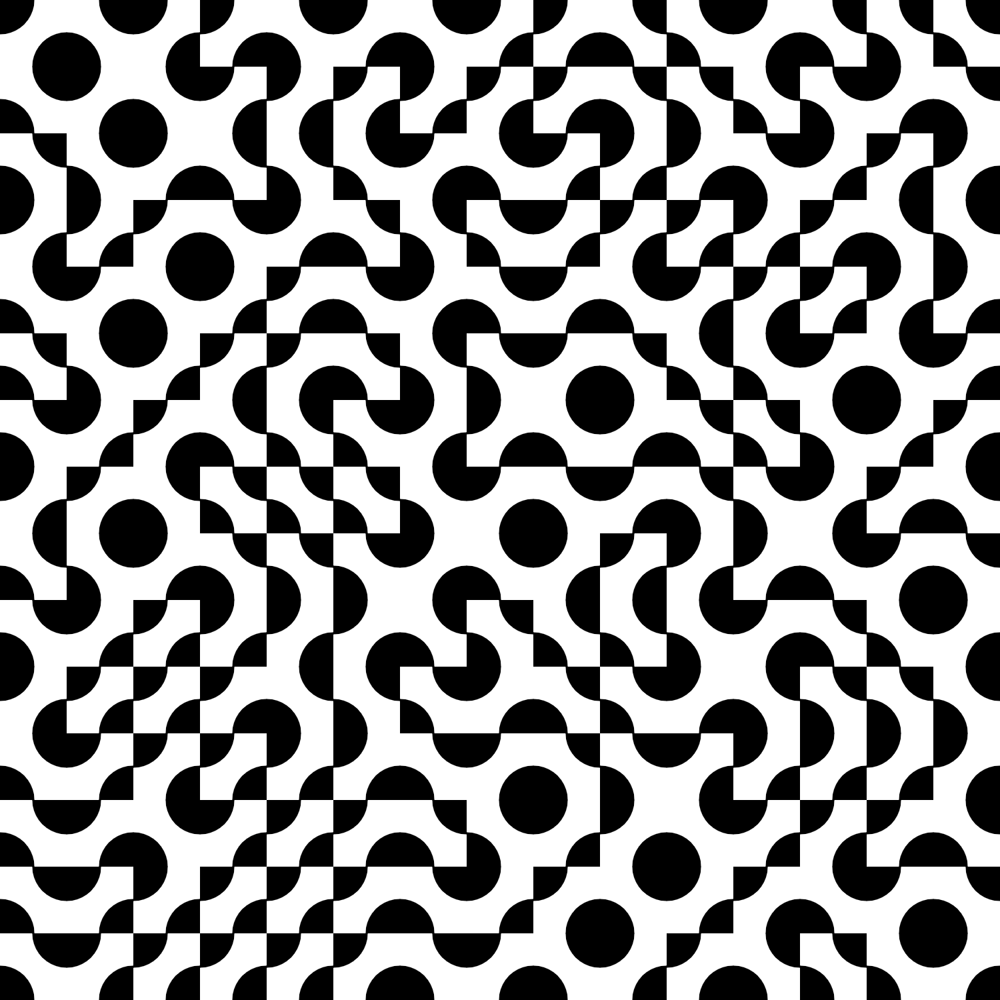
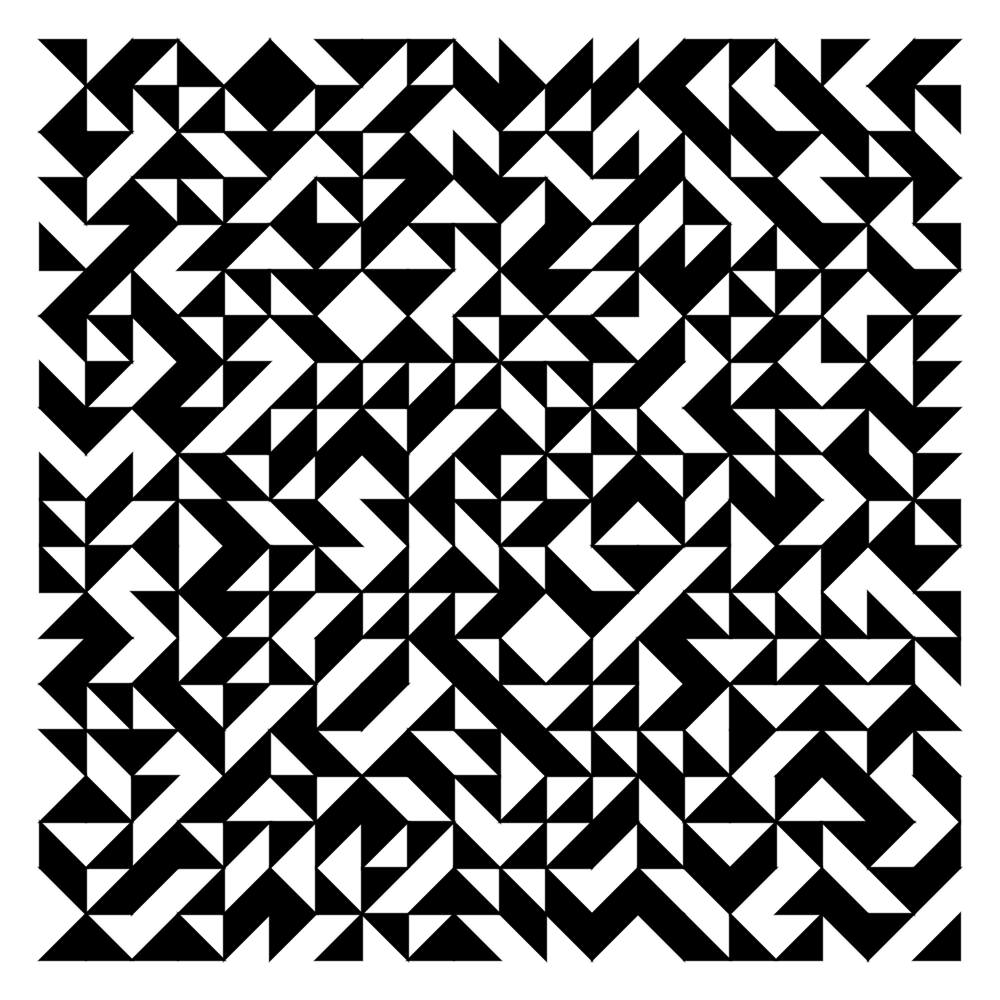

# Cours Processing B1 Ynov Bordeaux + Aix
*de avril à juin 2022*

#### Sketches en ligne
✍️ https://editor.p5js.org/v3ga/collections/BvWPJW2J4

#### Liste des étudiants + sketchbooks
https://docs.google.com/spreadsheets/d/1d4Jbf_otrK26GBLUw8B1tlpJUbZqkj_je8B4ND-srDU/edit#gid=0

## Thème
Au croisement du design graphique et de la programmation, ces cours proposeront d’utiliser l'environnement [Processing](https://processingfoundation.org/) / [p5.js](https://p5js.org/) pour créer, générer des formes géométriques afin de les imprimer à l’aide d’un [robot traceur](https://www.axidraw.com/) dans la lignée des pionniers de l'art génératif.

## Objectifs pédagogiques
* découverte de l'histoire de l'art génératif et plus largement du design génératif, évolutions des années 60 à nous jours.
* découverte de la programmation interactive temps réel, productions de visuels animés réagissant à des stimuli : mouvement(s), voix, ... 
* apprendre et maîtriser les concepts fondamentaux de la programmation : variables, boucles, branchements, fonctions. 
* apprendre à développer ses propres outils de création, création d'interface (UI) pour configurer et explorer les potentialités d'algorithmes de créations de formes graphiques.
* insérer ses productions de formes dans un workflow plus général : print, site web, installations interactives.

### Barême pour les exercices
Pour les exercices que je vous donne, le barême est le suivant (sur 10)
* **rendu en temps et en heure** :point_right: 1 point.
* **respect de la consigne** :point_right: 3 points. 
Le sketch doit être sauvegardé sur votre compte en ligne, l'addresse (URL) doit être insérée dans la colonne correspondante dans le document [Google Sheet en ligne](https://docs.google.com/spreadsheets/d/1d4Jbf_otrK26GBLUw8B1tlpJUbZqkj_je8B4ND-srDU/edit#gid=0). 
* **créativité** :point_right: 6 points. 
J'entends par créativité une recherche graphique personelle et/ou interactive qui peut se faire à partir de sketches vus en classe ou de références que vous trouvez en ligne.

## Cours 01
*Bordeaux / lundi 25 avril 2022*

### Introduction
* Présentation du travail de Julien Gachadoat.
* Présentation de l'environnement [Processing](http://www.processing.org) et de son « écosystème » (notamment [p5.js](https://p5js.org/))
* Présentation de l'environnement de développement et premières commandes de dessin dans l'éditeur en ligne [editor.p5js.org/](https://editor.p5js.org/) 

### Dessiner avec du code 
* repère de dessin, espace de dessin [p5js / createCanvas](https://p5js.org/reference/#/p5/createCanvas)
* dessin de formes géométriques : [point](https://processing.org/reference/point_.html), [line](https://p5js.org/reference/#/p5/line), [ellipse](https://p5js.org/reference/#/p5/ellipse), [rect](https://p5js.org/reference/#/p5/rect).
* dessin de formes géométriques « composées » : [beginShape](https://p5js.org/reference/#/p5/beginShape) / [vertex](https://p5js.org/reference/#/p5/vertex) / [endShape](https://p5js.org/reference/#/p5/endShape)
* gestion des couleurs ([color](https://p5js.org/reference/#/p5/color)) et des options de dessin([stroke](https://p5js.org/reference/#/p5/stroke), [noStroke](https://p5js.org/reference/#/p5/noStroke), [fill](https://p5js.org/reference/#/p5/fill), [noFill](https://p5js.org/reference/#/p5/noFill), [strokeWeight](https://p5js.org/reference/#/p5/strokeWeight))
* exporter / faire une capture d'écran avec la fonction [p5js / save](https://p5js.org/reference/#/p5/save)

### Références
* [A Modern Prometheus — The history of Processing by C.Reas & B.Fry](https://medium.com/processing-foundation/a-modern-prometheus-59aed94abe85)
* [Welcome to Processing](https://vimeo.com/140600280), vidéo en anglais par [Dan Shiffman](http://shiffman.net/) pour [la fondation Processing](https://processingfoundation.org/).
* [Design by Numbers](https://dbn.media.mit.edu/) de [John Maeda](https://maedastudio.com/)
* [Ben Fry](https://www.benfry.com/) and [Casey Reas](http://reas.com/)
* [Rune Madsen / Computational color](http://printingcode.runemadsen.com/lecture-color/)

#### Exercice
Choisir une des œuvres [« Homages to the square »](https://albersfoundation.org/art/josef-albers/paintings/homages-to-the-square/) de Josef Albers pour le récréer avec du code.

## Cours 02
*Bordeaux / lundi 9 mai 2022*

### Introduction
* retour sur les notions vus au cours 01 avec le dessin d'un visage de Bruno Munari. Nous introduirons à ce sujet la notion de **variable** que nous reverrons dans le cours 03. 

Bruno Munari est un artiste plasticien italien. Peintre, sculpteur, dessinateur, designer, il est également auteur et illustrateur de livres pour enfants (source : [wikipedia](https://fr.wikipedia.org/wiki/Bruno_Munari))

### Animer
* Animer : 
  * avec une fonction génératrice de nombre aléatoires : [random](https://p5js.org/reference/#/p5/random)  
  * avec la variable de temps [frameCount](https://p5js.org/reference/#/p5/frameCount) et la fonction [millis()](https://p5js.org/reference/#/p5/millis)
  * avec les variables [mouseX](https://p5js.org/reference/#/p5/mouseX) et [mouseY](https://p5js.org/reference/#/p5/mouseY) pour capter la position de la souris dans le canvas.

#### Exercice à rendre
Créez un visage dans le style de Bruno Munari en utilisant des formes géométriques.
Ajouter un élément d’interactivité en utilisant [la position de la souris](https://p5js.org/reference/#/p5/mouseX) ou la fonction [random](https://p5js.org/reference/#/p5/random). Le visage se dessinera sur un canvas de dimensions (500,500) pixels, les couleurs à utiliser sont le noir et le blanc uniquement. 

L'exercice sera à rendre pour le **dimanche 22 mai** au plus tard, l'addresse du sketch est à placer dans la colonne correspondante sur le document en ligne : https://docs.google.com/spreadsheets/d/1d4Jbf_otrK26GBLUw8B1tlpJUbZqkj_je8B4ND-srDU/edit#gid=0

### Références
* Dan Shiffman [EN] - [Using random()](https://www.youtube.com/watch?v=50Rzvxvi8D0)
* Manuel Floss [FR] - [Dessiner / les évènements souris](https://fr.flossmanuals.net/processing/les-evenements-souris/)
* [Generative Gestaltung Walker](http://www.generative-gestaltung.de/2/sketches/?01_P/P_2_2_1_02) 

## Cours 03
*Bordeaux / lundi 16 mai 2022*

### Introduction à la notion de [variable](https://p5js.org/reference/#/p5/let)
* variables prédéfinies vues dans les cours précédents : mouseX / mouseY, width / height, frameCount.
* création / utilisation d'une variable dans un sketch simple. 
* Variable pour la gestion d'un media : 
  * Chargement et affichage d'une image, gestionnaire [preload()](https://p5js.org/reference/#/p5/preload)
  * Utiliser la fonction [imageMode()](https://p5js.org/reference/#/p5/imageMode) pour changer l'origine du dessin de l'image.
  * utilisation des informations de couleurs pour générer une composition : effet de « pointillisme ».

#### Exercice à faire en cours
* reprendre le sketch de dessin avec la souris ( https://editor.p5js.org/v3ga/sketches/-TrdeNAX9 )
* remplacer le dessin du cercle par le dessin d'une image que vous aurez éditée avec un logiciel de dessin, dans l'idée de définir vous-même une brush de dessin. Plusieurs opérations à faire : 
  * dupliquer [le sketch d'exemple](https://editor.p5js.org/v3ga/sketches/-TrdeNAX9) pour le sauver dans votre sketchbook.
  * créer la variable associée à l'image.
  * charger l'image dans en utilisant le gestionnaire [preload()](https://p5js.org/reference/#/p5/preload).    

### Structure de branchement [if-else](https://p5js.org/reference/#/p5/if-else)
* exemple avec affichage d’un objet en fonction de la position de la souris.
* Modélisation d'un objet (bille), rebond sur les bords de l'écran.

## Cours 04
*Bordeaux / lundi 23 mai 2022*

### Introduction à la notion de [boucle](https://p5js.org/reference/#/p5/for)
* répétition d’un élément graphique de façon « naïve ».
* utilisation d'une boucle pour réaliser le même sketch. 
* création d'une double boucles imbriquées : pavage de du canvas avec un motif, modulation de la taille des motifs en fonction de la souris et du temps.
* Utilisation de cette grille pour reprogrammer une œuvre de [Vera Molnar](http://www.veramolnar.com/) : Quatre éléments ditribués au hasard (1959)

#### Liens
* [fonction sinus](https://editor.p5js.org/domestika_julien/sketches/kph_sR4VO)

## Cours 05
*Bordeaux / lundi 30 mai 2022*

Aujourd'hui nous allons apprendre à générer des formes composées à partir d’une forme simple qui sera dupliquée et transformée. Pour cela nous allons exploiter les fonctions de transformations du repère ([translate](https://p5js.org/reference/#/p5/translate), [rotate](https://p5js.org/reference/#/p5/rotate), [scale](https://p5js.org/reference/#/p5/scale)), combinées avec la structure de boucle que nous avons vus la semaine passée.
Nous apprendrons aussi à relier une variable à un élément d'interface graphique (UI) pour explorer plus facilement les potentialités de notre algorithme. 

#### Projet pour la fin de l'année
Le projet sera d'imprimer avec un traceur [axidraw](https://www.axidraw.com/) des cartes de visite, sur deux faces.
Le visuel principal sera produit avec un sketch p5.js, les informations (à définir ensemble) seront produites plus traditionnellement avec une application de dessin vectoriel. 
Étant donné que vous être nombreux, il sera difficile (je pense) d'en faire plus d'une ou deux par étudiant. 
Nous partirons sur trois principes graphiques principaux : 
* le principe de compositions de motifs sur une grille vues au cours 04.
* le principe de formes composées vu aujourd'hui.
* et un principe libre si vous le souhaitez.
La contrainte principale sera de travailler en noir et blanc et avec des lignes seuleument (pas de remplissage de formes). Une autre contrainte sera de pouvoir exporter au format vectoriel SVG, ce que ne permet pas par défaut p5.js (export au format image seuleument) Pour ce faire, j'ai préparé des sketches qui reprennent ce que nous avons vu mais avec la possibilité de sauvegarder au format vectoriel.

 

